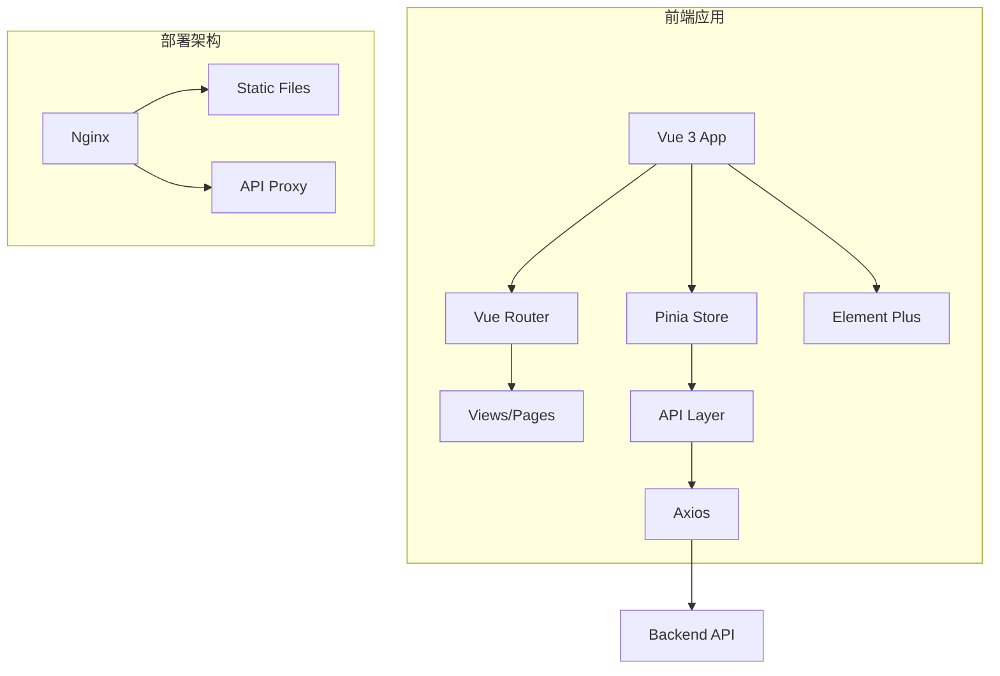
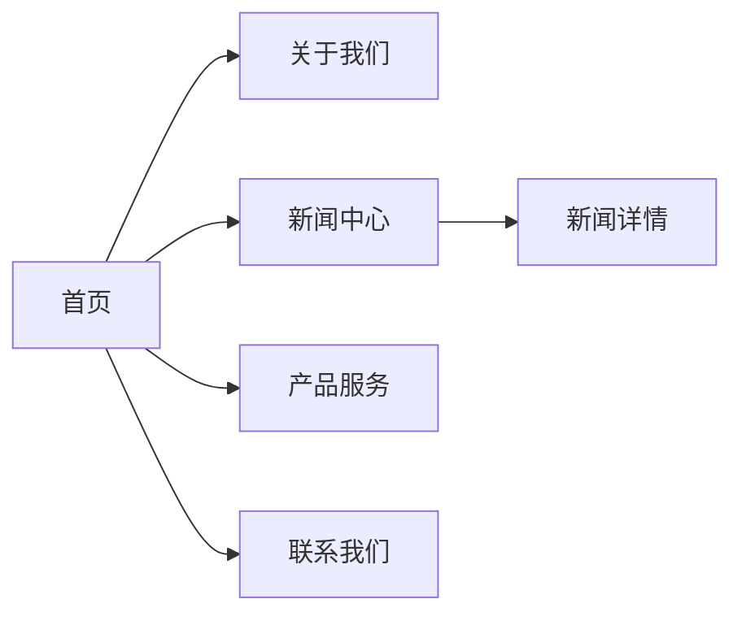
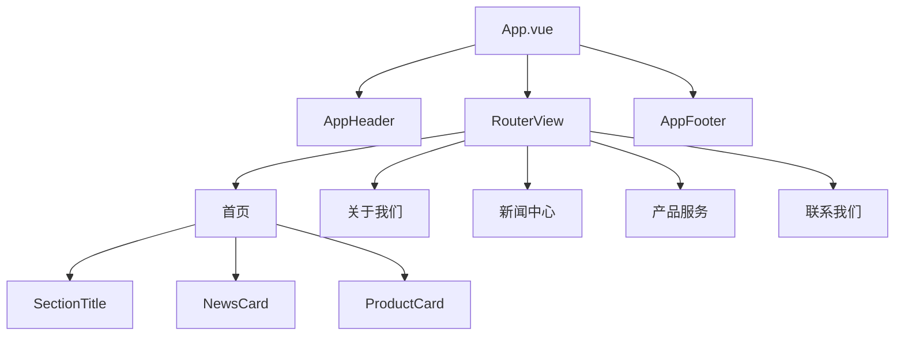

# 门户网站前端项目设计文档

## 系统架构

## 页面结构

## 组件层级

## UI/UX 规范

### 颜色系统

| 用途 | 颜色值 | 说明 |
|------|--------|------|
| 主色 | #1890ff | 品牌主色调 |
| 主色-浅 | #40a9ff | Hover 状态 |
| 主色-深 | #096dd9 | Active 状态 |
| 成功 | #52c41a | 成功提示 |
| 警告 | #faad14 | 警告提示 |
| 错误 | #ff4d4f | 错误提示 |
| 文字-主要 | #303133 | 标题文字 |
| 文字-常规 | #606266 | 正文文字 |
| 文字-次要 | #909399 | 辅助文字 |
| 背景 | #f5f7fa | 页面背景 |

### 间距系统

| 名称 | 值 | 用途 |
|------|-----|------|
| xs | 4px | 紧凑间距 |
| sm | 8px | 小间距 |
| md | 16px | 中等间距 |
| lg | 24px | 大间距 |
| xl | 32px | 超大间距 |
| xxl | 48px | 区块间距 |

### 字体系统

| 名称 | 大小 | 用途 |
|------|------|------|
| xs | 12px | 辅助文字 |
| sm | 14px | 正文 |
| md | 16px | 小标题 |
| lg | 18px | 中标题 |
| xl | 20px | 大标题 |
| xxl | 24px | 区块标题 |
| title | 32px | 页面标题 |

### 圆角系统

| 名称 | 值 | 用途 |
|------|-----|------|
| sm | 4px | 按钮、标签 |
| md | 8px | 卡片 |
| lg | 12px | 大卡片 |
| round | 50% | 圆形 |

### 阴影系统

| 名称 | 值 | 用途 |
|------|-----|------|
| sm | 0 2px 8px rgba(0,0,0,0.08) | 卡片默认 |
| md | 0 4px 16px rgba(0,0,0,0.1) | 卡片悬浮 |
| lg | 0 8px 24px rgba(0,0,0,0.12) | 弹窗 |

## 接口清单

### 新闻模块

| 接口 | 方法 | 说明 |
|------|------|------|
| /api/news/list | GET | 获取新闻列表 |
| /api/news/:id | GET | 获取新闻详情 |
| /api/news/recommend | GET | 获取推荐新闻 |

### 联系模块

| 接口 | 方法 | 说明 |
|------|------|------|
| /api/contact/submit | POST | 提交联系表单 |

## 状态管理

### App Store

- loading: 全局加载状态
- siteTitle: 网站标题
- siteDescription: 网站描述

### News Store

- newsList: 新闻列表
- currentNews: 当前新闻详情
- loading: 加载状态
- total: 总数
